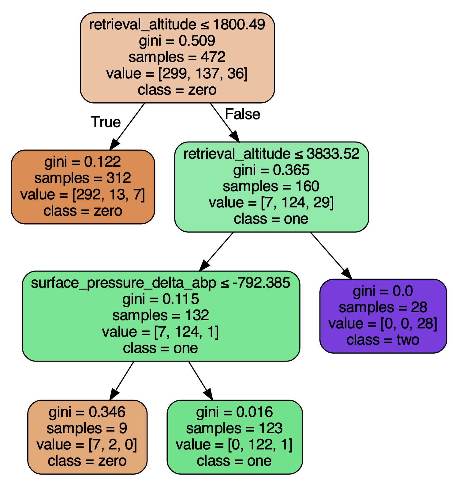
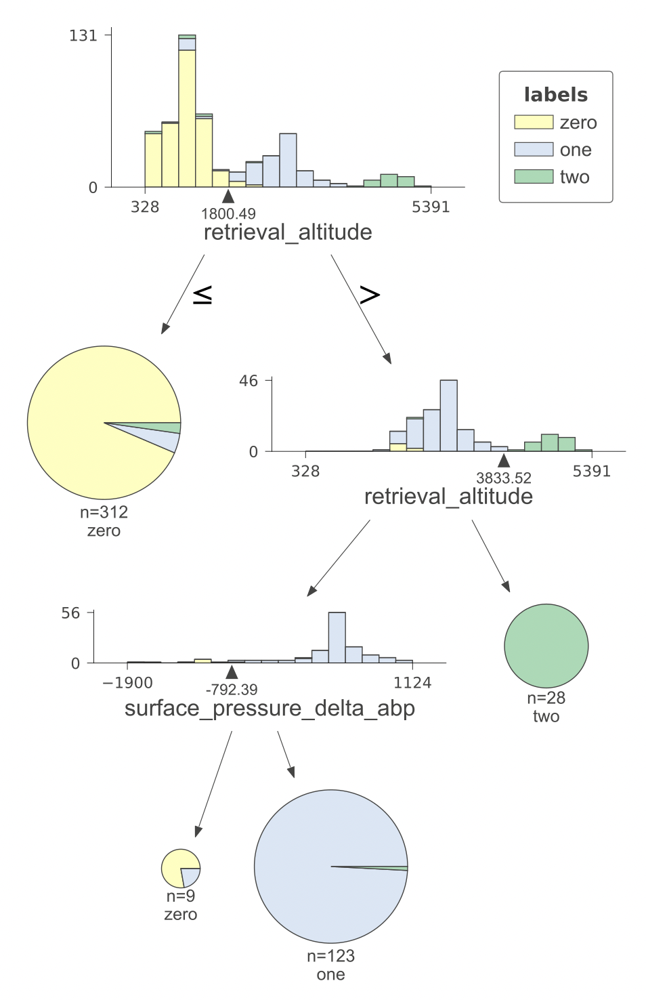
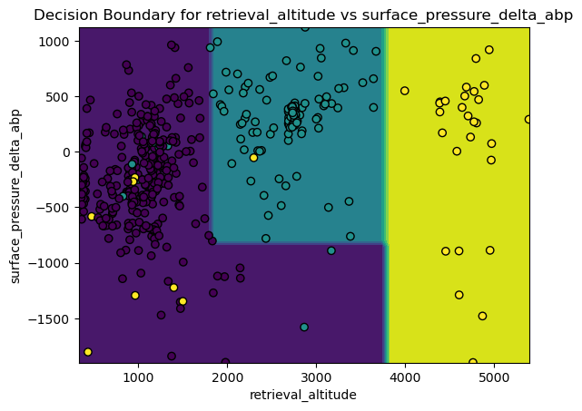

# Rover Satellite Decision Tree Analysis

This repository gives the code and results of a decision tree analysis of data from a satellite communicating with the Mars rover.

## Overview

Here we analyze data from a satellite orbiting mars and communicating with the Mars rover.  Each data point has various features, such as different types of albedo, fluorescence, surface pressure, latitude and longitude, etc. There are three classes, the meaning of these three classes are not given but signifies some sort of statistic regarding the communication between the satellite and the Mars rover. The goal is to run a decision tree analysis of the data.

Process and Initial Results:

First we clean the data, removing duplicate entries and data with latitude and longitude not near the the rover. If we ran the decision tree on the data, the result would be a complex tree with many splits. In order to avoid needless complexity and splits that do generalize, we use leave-one-out-cross-validation (LOOCV), and we limit the number of splits based on minimum split size and minimum impurity decrease. The tree with the best LOOCV is relatively simple, splitting three times on a total of two categories, "retrieval_altitude", and "surface_pressure_delta_abp". This tree has a LLOCV classification accuracy of 95.13 \%, an improvement of 2.55 \% from the unpruned tree, which has a LLOCV classification accuracy of 92.58 \%.

## Plots and Figures

A diagram of the decision tree using graphviz. There are only two splits, with the most significant splits occurring over retrieval_altitude.

A more informative plot of the decision_tree splits using dtreeviz. For each split, a pie chart displays the proportion of classes. A histogram also displays the concentration of the classes over the splitting feature values, and indicates the splitting threshold.

Plot of the decision tree regions The decision region can be plotted on a 2-D graph because the decision tree splits in exactly two features.